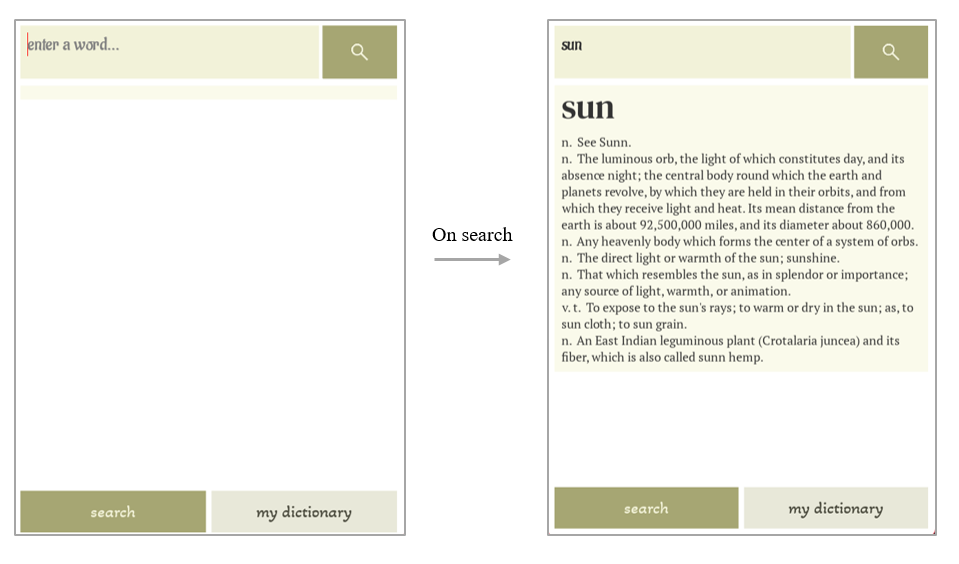
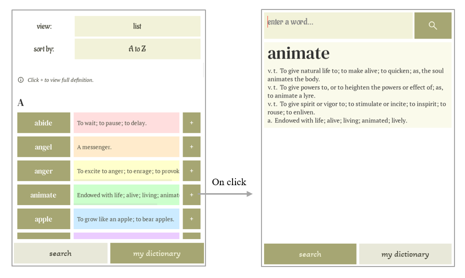
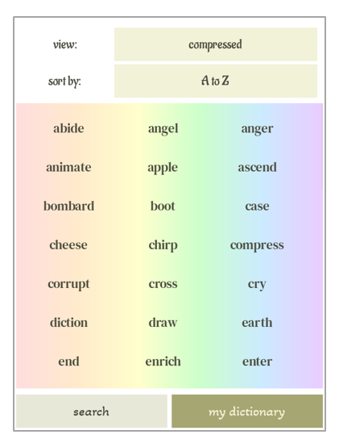
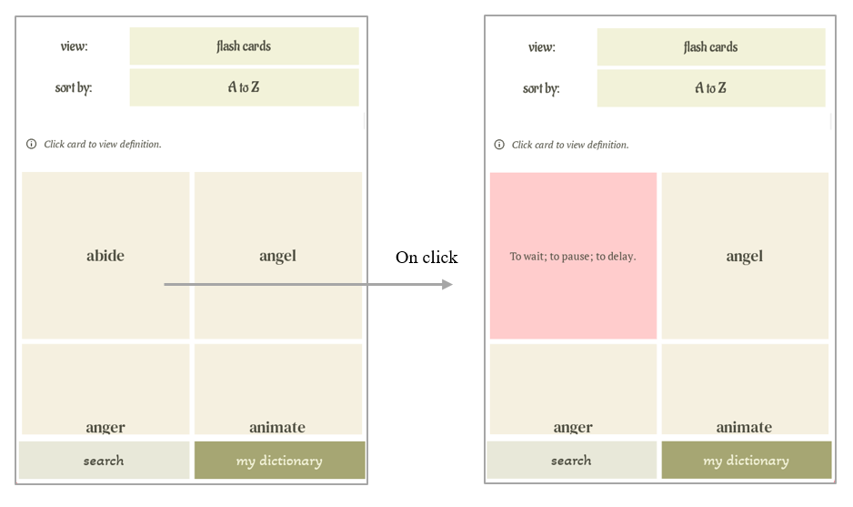
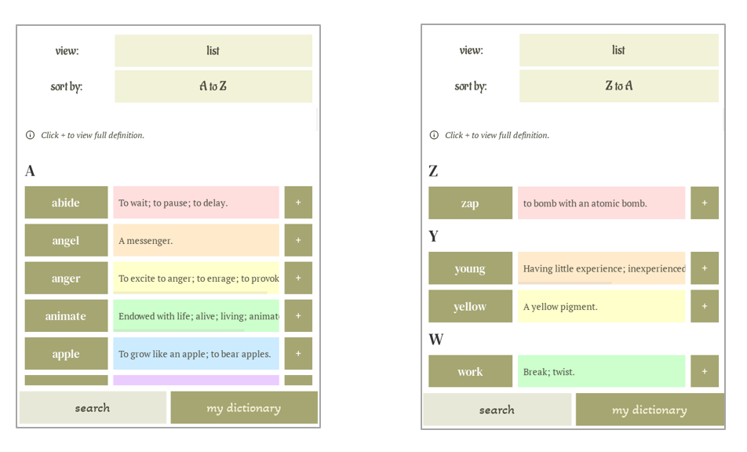
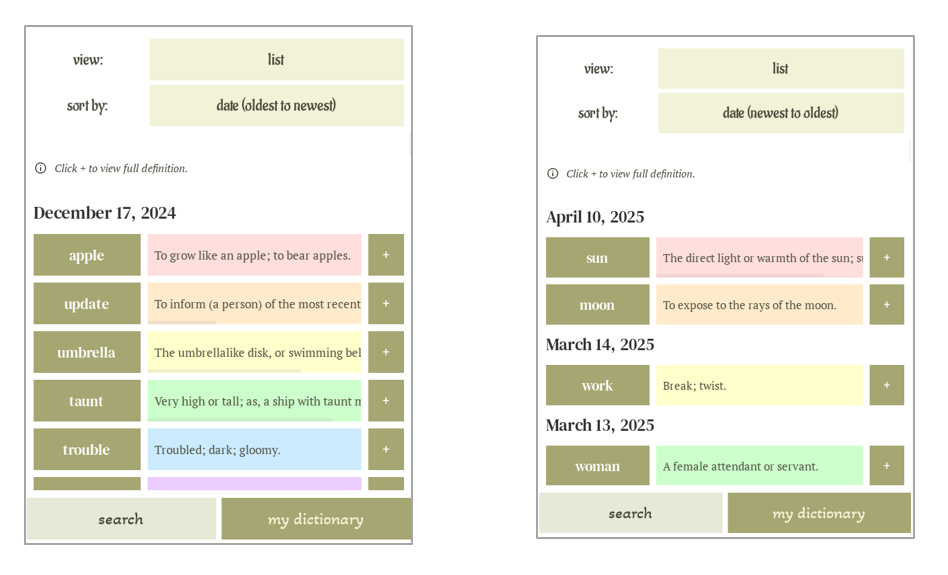
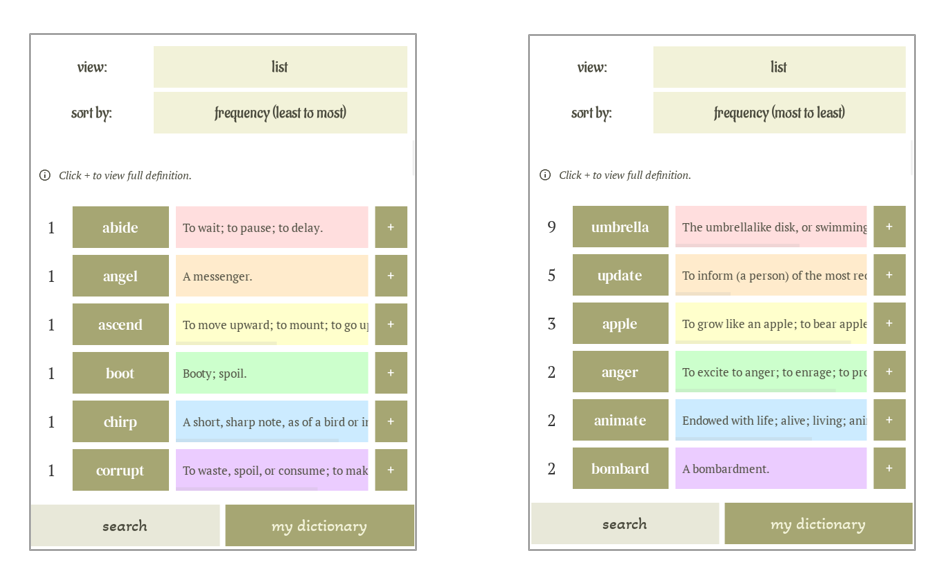

## Functionalities

### 1. Search Words
- Enter a word on the search screen to fetch definitions and parts of speech from the web.  
  - Press the button with the search icon or hit Enter.  
- The searched word and its definitions are automatically saved to a local database.  
  - If the word had been searched previously, definitions are fetched from the local database instead of the web.

### 2. Review Words
- Switch to the “My Dictionary” tab to view all searched words.
  
- Choose from three view modes:  
  - List View
    - Word and shortest definition displayed side-by-side  
    - Definitions scrollable horizontally
    - Press the ‘+’ button beside a word to return to the search screen and view all definitions of that word

  - Compressed View
    - Simple word grid for scanning saved vocabulary quickly

  - Flash cards View
    - Review words by tapping on a card to reveal the shortest definition

- Choose from six sorting modes:  
  - Alphabetical (A → Z, Z → A)

  - By Search Date (Newest → Oldest, Oldest → Newest)

  - By Search Frequency (Most → Least, Least → Most)  
    - Frequency appears as a numerical label to the left of each word  

- Default mode is List View with A → Z sorting  
- Returning to the Dictionary screen preserves the last used view and sort mode
