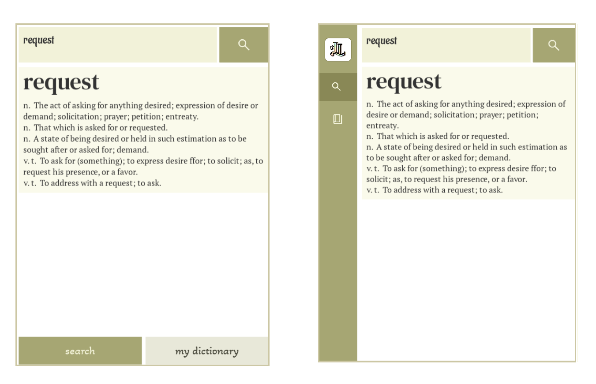
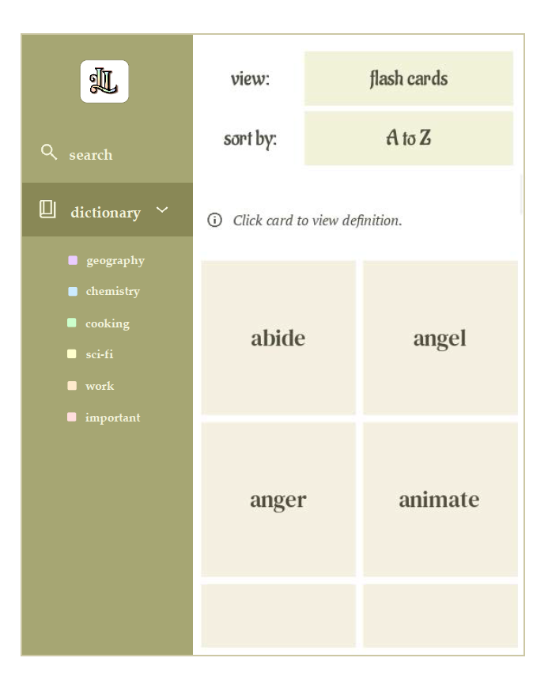

## Future Developments

The prototype for Living Lexicon lays the foundation for an interactive dictionary experience. Future versions may refine and expand on these key areas:

1. **Enhanced visuals**
   - List view: Collapsible sections (e.g., hide/show words under each letter)  
   - Flash cards view:  
     - Horizontal flip animation  
     - “Flip all” option  
     - Lined paper design on definition side  
     - Swipe sideways to preview parts of definition  

2. **Personalized vocabulary lists**
   - Organize saved words into categories or “lessons” related to work, school, interests, media titles, etc. (e.g., Chemistry, Geography, Cooking)  
   - Drag and drop words into different lists  
   - Visual indicators show which words belong to which categories  
   - Custom order lessons and words within them  
   - Quick-add option to save searches directly to a chosen list
   - Collapsible sidebar to replace navigation buttons on the bottom of the screen:
     
     Sidebar expands when double-clicked, revealing nested lessons under the My Dictionary tab:
     

3. **Improved learning experience**
   - Generate review lists for recently added words (e.g., past day, week, month, or five most recent words)  
   - Create randomized word lists with a set number of words  
   - Move mastered words into an “already learned” category to declutter active lists  
   - Toggle on/off whether searched words are automatically committed to My Dictionary  
   - Sort lists by shuffling them  
   - Flexible definition navigation:  
     - In list view, scroll up and down to cycle through multiple definitions or expand to view all  
     - In flashcard view, swipe through multiple definitions for a word or set a preferred one to display  

4. **Expanded functionality**
   - Export/copy/print dictionary as list  
   - Search within saved words  
   - Example sentences for each definition (sourced from integrated dictionaries, dynamic web retrieval, or manual user input)  
   - Support for phrases, idioms, and expressions  
   - Delete words individually or in bulk  

5. **Account system and sharing features**
   - Create accounts to sync words across devices  
   - Allow users to share specialized word lists — e.g., a teacher sharing curated lists with students based on subject  

6. **Advanced features for long-term expansion**
   - Aesthetic options: themes, dark mode  
   - Integration: save words directly from eBooks, web articles, and apps  
   - Multilingual support: define English words in different languages and allow switching between language modes  
   - Voice features: word pronunciation playback and voice search  
   - Statistics and insights: visual graphs showing vocabulary growth, category usage, search trends, and learning streaks  
   - AI-powered enhancements:  
     - AI-generated example sentences  
     - Word predictions while typing  
     - Suggest categories for newly added words and automatically organize words by topic  
     - Recommend related words to add to categories  

